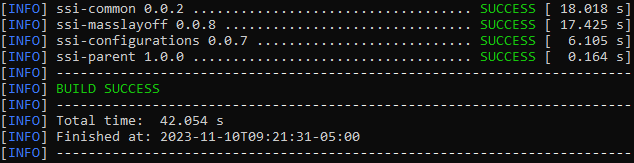
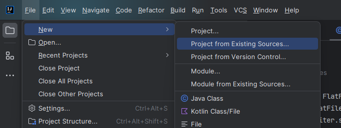
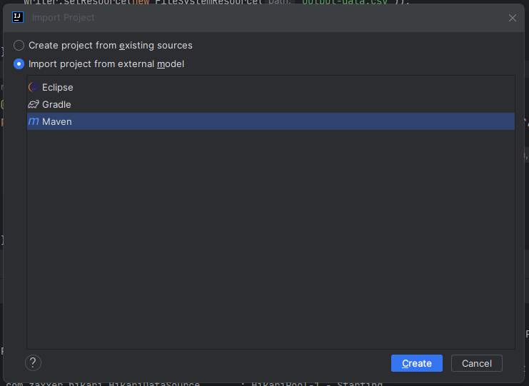
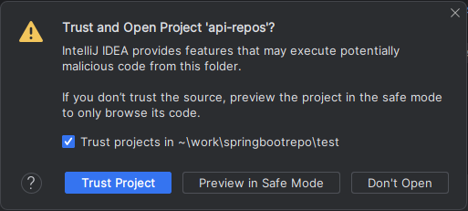
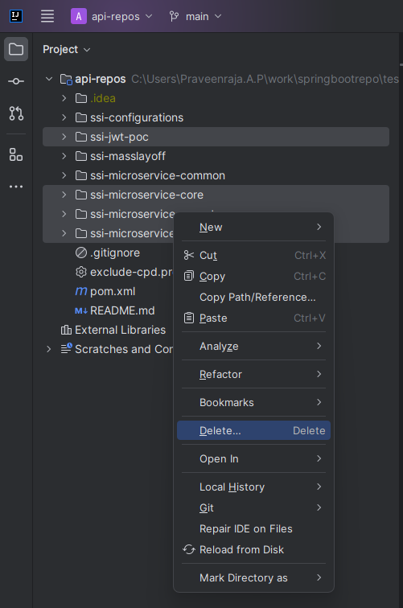
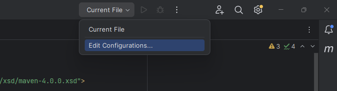
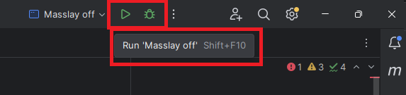
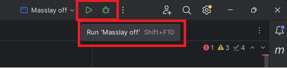
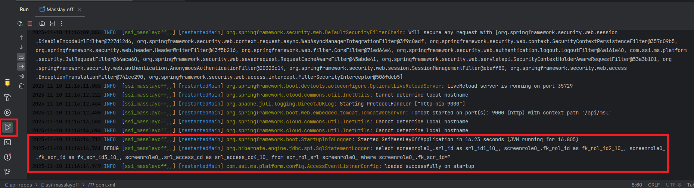

# Micro-service set up and Dev deployment

## Description

Briefly describe your Spring Boot application. What does it do? What problem does it solve?

## Table of Contents

- [Prerequisites](#prerequisites)
- [Getting Started](#getting-started)
- [Configuring IntelliJ](#configuring-intellij)
- [Build and Run](#build-and-run)
- [Usage](#usage)


## Prerequisites

- [Java](https://www.oracle.com/java/technologies/javase-downloads.html) (version 17)
- [Maven](https://maven.apache.org/download.cgi) (version 3.8 or higher)
- [Git](https://git-scm.com/download/gui/windows)
- [IntelliJ IDEA Community Edition](https://www.jetbrains.com/idea/download/?section=windows)

## Getting Started

Clone the repository to your local machine:

```bash
cd <your parent folder>
git clone https://github.com/adas-sym/api-repos.git
cd api-repos
mvn clean install
```
Make sure the Build is successfull.



## Configuring IntelliJ

Import project into intelliJ. Follow the following steps.

Select Project form existing sources
<p align="center">
  
</p>

Select as Maven Project
<p align="center">
  
</p>

Trust the Repo
<p align="center">
  
</p>

Delete the unused Projects from the workspace
<p align="center">
  
</p>

Top right corner, Edit Configurations to configure the project
<p align="center">
  
</p>

In the pop up click on Add new project --> select Application.
<p align="center">
  
</p>

Follow the video to configure the project.

https://github.com/adas-sym/api-repos/assets/15310432/95ddaca3-ae3e-42bf-95b3-708fb2e474a3


## Build and Run

### Development server

On Top right corner, select masslay off and Run or Debug project.
<p align="center">
  
</p>

Check the console log to verify the successfull start of the project.
<p align="center">
  
</p>

### Run as individual server

```bash
mvn clean install -Drevision=<reversion number>
```

Run the application stand alone:

```bash
SET JAVA_HOME=<java 17 folder>
SET PATH=JAVA_HOME\bin;.;%PATH%
java -jar ssi-masslayoff/target/ssi-masslayoff-<reversion number>.jar -Dspring.profiles.active=<profile> -Dserver.port=<port number> -Xmx512 
```

## Usage

Explain how to use your application. Include examples or screenshots if necessary.